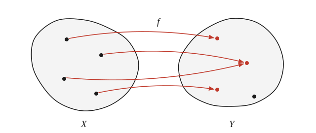
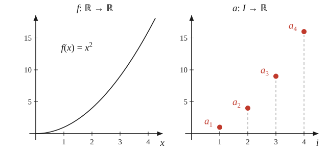
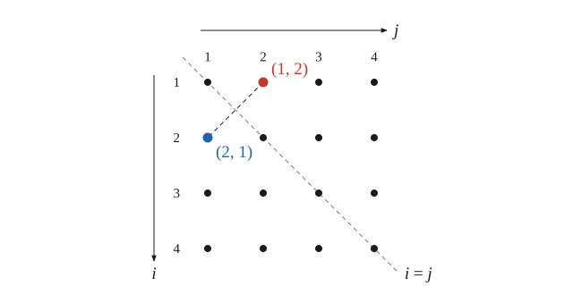
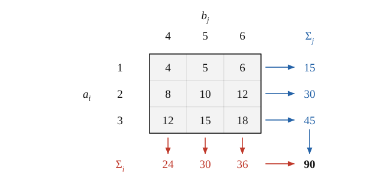
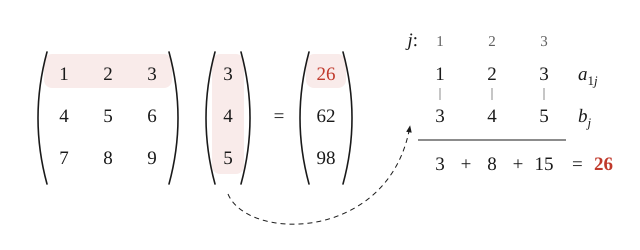
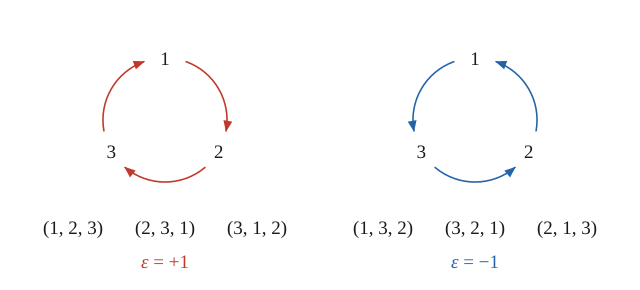

# Лекция 1. Индексы

> **Необходимые знания:** множество, отображение, декартово произведение множеств, числовая функция, определённый интеграл, последовательность, матрица и умножение матриц.
>
> **О чем лекция:** индексные и многоиндексные функции как функции на конечном множестве; способы их задания, равенство и операции над ними. Суммы, свободные индексы и индексы суммирования, перестановочность сумм. Матричное умножение на языке индексов. Символы Кронекера и Леви-Чивиты.

Сегодня — вводная лекция. К линейной алгебре и тем более к тензорам она пока не относится: речь пойдёт о функциях и об индексах. Зачем это нужно? Тензоры данного типа образуют линейное пространство, в нём можно выбрать базис, и в базисе у тензора появляются компоненты — то, что часто называют «набором чисел». Компоненты записываются выражениями вроде

$$
a_i, \qquad b_{ij}, \qquad \sum_{k=1}^{n} a_{ik} b_{kj}, \qquad \delta_{ij}, \qquad \varepsilon_{ijk},
$$

и с ними приходится проделывать всевозможные суммирования (свёртки). Ничего сложного в этом нет. Однако такой материал принято считать очевидным, поэтому подробно его нигде не объясняют, а без твёрдого понимания того, что здесь можно писать и чего нельзя, в дальнейшем в голове возникает каша. Поэтому индексам отведена отдельная лекция.

Главная мысль лекции: всё, что мы знаем о привычных функциях на $\mathbb{R}$, более или менее дословно переносится на функции, заданные на конечном множестве, и там всё только проще. Непривычно лишь то, что место интегралов занимают суммы. Поэтому на каждом шаге мы будем сопоставлять новое с тем, что уже известно о функциях на $\mathbb{R}$.

## 1. Функции и отображения

Понятие функции знакомо со школы; в университете его обобщают до понятия отображения. Пусть $X$ и $Y$ — два множества. **Отображением** $f\colon X \to Y$ называется правило, которое каждому элементу $x \in X$ сопоставляет единственный элемент $f(x) \in Y$. Единственность существенна: элемент $X$ не может переходить сразу в два разных элемента $Y$. При этом не требуется, чтобы каждый элемент $Y$ был образом какого-нибудь $x$, и разные элементы $X$ могут переходить в один и тот же элемент $Y$ (рис. 1).

*Рис. 1. Отображение $f\colon X \to Y$: из каждой точки $X$ выходит ровно одна стрелка. Две стрелки могут прийти в одну точку $Y$, а некоторые точки $Y$ могут остаться без стрелок.*

Функции, операторы, функционалы — всё это отображения; разные названия отражают лишь то, между какими множествами отображение действует. **Числовой функцией**, или просто функцией, называют отображение из множества чисел в множество чисел, например $f\colon \mathbb{R} \to \mathbb{R}$. Запись

$$
f\colon \mathbb{R} \to \mathbb{R}, \qquad f(x) = x^2
$$

означает, что каждому действительному числу сопоставлен его квадрат. Следует чётко понимать: имя функции — $f$. Буква $x$ — лишь обозначение аргумента, к самой функции она никакого отношения не имеет. Записи

$$
f(x) = x^2 \qquad \text{и} \qquad f(y) = y^2
$$

описывают одну и ту же функцию $f$: закон «возвести в квадрат то, что подано на вход» не зависит от того, как назвать вход. А вот запись $f(x) = y^2$ — бессмыслица. По той же причине пишут $f\colon \mathbb{R} \to \mathbb{R}$, указывая имя функции, но никогда не $f(x)\colon \mathbb{R} \to \mathbb{R}$.

Это действительно важно, хотя бы потому, что физика приучает к противоположному. В физике одну и ту же величину часто обозначают одной буквой, даже когда с математической точки зрения речь идёт о разных функциях: давление $p(T, V)$ как функцию температуры и объёма и давление $p(T, S)$ как функцию температуры и энтропии. Физически это одно и то же давление, математически — две разные функции, и обозначаться они должны разными буквами. Этим удобством мы злоупотреблять не будем.

Функцию можно задать формулой, графиком или таблицей значений. Таблица годится, только если аргумент принимает конечное число значений: бесконечную таблицу не выпишешь. Зато в этом случае она оказывается лучшим способом. Именно такими функциями мы и займёмся.

## 2. Индексные функции

Функции на всём множестве действительных чисел, с которыми мы привыкли работать со школы, на самом деле устроены сложнее, чем то, чем мы будем заниматься сегодня. Зафиксируем натуральное $n \in \mathbb{N}$ и рассмотрим множество первых $n$ натуральных чисел

$$
I = \{1, 2, 3, \dots, n\}.
$$

**Индексной функцией** называется любое отображение $a\colon I \to \mathbb{R}$. Подчеркнём: значения такой функции — обычные действительные числа, дискретна лишь её область определения. На жаргоне такие функции называют просто индексами. По чисто визуальным причинам для них принята особая запись: вместо $a(i)$ пишут $a_i$. По определению

$$
a_i \equiv a(i), \qquad i \in I.
$$

Здесь $a$ — имя функции, $i$ — имя её аргумента, а $a_i$ — значение функции $a$ на элементе $i$. Всё сказанное выше об именах функций и аргументов остаётся в силе.

Как задать индексную функцию? Можно построить её график, но он выродится в $n$ отдельных точек (рис. 2) и ничего не добавит. Можно задать её формулой, например $a_i = i^2$, но так везёт редко. Даже для функции на $\mathbb{R}$ подобрать формулу непросто: попробуйте найти формулу для кривой, нарисованной от руки, или для кривой с изломом, полученной в эксперименте. Самый естественный способ — просто перечислить значения функции во всех $n$ точках, т. е. составить таблицу.

*Рис. 2. Слева — график функции $f\colon \mathbb{R} \to \mathbb{R}$, $f(x) = x^2$: непрерывная кривая. Справа — график индексной функции $a\colon I \to \mathbb{R}$, $a_i = i^2$, при $n = 4$: всего четыре точки.*

Пусть, например, $I = \{1, 2, 3, 4\}$ и $a_i = i + 1$. Таблица

| $i$ | $a_i$ |
|---|---|
| $1$ | $2$ |
| $2$ | $3$ |
| $3$ | $4$ |
| $4$ | $5$ |

задаёт эту функцию полностью. Обратите внимание, как мало здесь информации: чтобы полностью задать функцию $\mathbb{R} \to \mathbb{R}$, пришлось бы основательно потрудиться.

Близкий и хорошо знакомый объект — последовательность. В математическом анализе последовательность $(a_i)$ по определению есть отображение $a\colon \mathbb{N} \to \mathbb{R}$ с той же записью $a_i \equiv a(i)$. Это та же индексная функция, только определённая на бесконечном множестве. Здесь тоже полезно помнить, что последовательность — это функция $a$, а $i$ лишь пробегает значения $1, 2, 3, \dots$. Если одну и ту же последовательность в одном месте записали как $a_i$, а в другом как $a_j$, то ничего не изменилось.

*Замечание.* Вообще, полезно переформулировать знакомые понятия на строгом языке множеств и отображений. Что такое, например, уравнение, скажем $2 + x = 3$? Решение уравнения ищется среди элементов некоторого множества: для алгебраического уравнения — среди чисел, для дифференциального — среди функций. Уравнение можно понимать как отображение этого множества в множество из двух элементов $\{\text{да}, \text{нет}\}$: подставляем число — равенство выполняется или не выполняется. Множество, на котором ищется решение, — часть постановки задачи: уравнение $2 - x = 3$ не имеет решений среди натуральных чисел, но имеет решение среди целых. Сама по себе такая переформулировка ничего не даёт, но строгий язык помогает навести порядок в голове.

<!-- ПРОВЕРИТЬ 00:23:52: в записи «2 минус х равно 3 ... не будет иметь решение среди натуральных чисел, зато будет иметь среди целых», а на доске (с. 2 заметок) — 2 + x = 3. Оставлено 2 − x = 3: для 2 + x = 3 утверждение неверно (x = 1). -->

## 3. Равенство и операции

Как уже было сказано, в записи $a_i$ буква $a$ — имя функции, а $i$ — имя аргумента. Нужно чётко понимать, что именно приравнивается: сами функции или их значения. Рассмотрим пример. Пусть $I = \{1, 2, 3, \dots, n\}$ и

$$
a_i = i, \qquad b_j = j.
$$

Записать вторую функцию как $b_j = j$ или как $b_i = i$ — всё равно: это одна и та же функция $b$, так же как $f(x) = x^2$ и $f(y) = y^2$ — одна функция.

Можно ли написать $a = b$? Да. Это равенство функций: $a$ и $b$ — одна и та же функция, которая возвращает поданный на вход аргумент без изменений (её непрерывный аналог — $f(x) = x$). Мы лишь назвали её двумя разными именами.

Можно ли написать $a_i = b_i$? Здесь приравниваются уже не функции, а их значения при каком-то конкретном $i$. В такой записи молчаливо подразумевается, что $i$ — любой из допустимого диапазона. Аккуратно это нужно указать явно:

$$
a_i = b_i, \qquad i \in I.
$$

Указание множества существенно, потому что значения функций могут совпадать не везде. Для $f(x) = x$ и $g(x) = |x|$ можно написать $f(x) = g(x)$ при $x \geqslant 0$, но не при всех $x$. Точно так же для индексных функций равенство значений может выполняться при одних $i$ и не выполняться при других.

А вот запись $a_i = b_j$ — бессмыслица: слева значение функции $a$ при одном аргументе, справа значение функции $b$ при другом, и никакой связи между ними не указано. Это бессмыслица того же рода, что и $f(x) = y^2$.

Второй пример. Пусть $a_i = i$ и $b_i = i + 1$, $i \in I$. Какие из записей

$$
b = a + 1 \qquad \text{и} \qquad b_i = a_i + 1, \quad i \in I,
$$

корректны? Обратимся к аналогии с функциями на $\mathbb{R}$. Для $f(x) = x$ и $g(x) = x + 1$ мы без колебаний пишем $g(x) = f(x) + 1$. Ровно так же корректна вторая запись — с указанием, какому множеству принадлежит $i$. Первая запись тоже правильна, но только если понимать $1$ не как число, а как функцию: складывать функцию с числом нельзя, это объекты разной природы. Понимающий читатель подразумевает здесь функцию $1\colon I \to \mathbb{R}$, которая всюду равна единице:

$$
1_i \equiv 1(i) = 1 \in \mathbb{R}, \qquad i \in I.
$$

Слева в этой записи $1$ — имя функции, справа — число.

Арифметические операции над индексными функциями определяются так же, как над обычными функциями. Если $a, b\colon I \to \mathbb{R}$, то

$$
c_i = a_i b_i, \qquad i \in I,
$$

задаёт новую функцию $c\colon I \to \mathbb{R}$ — в полной аналогии с $h(x) = f(x)\, g(x)$. Точно так же функции можно складывать, вычитать, делить (там, где знаменатель не обращается в нуль), возводить одну в степень другой. Композиция, т. е. подстановка одной функции в другую, как в $g(f(x))$, для индексных функций почти не встречается: записывать её в индексных обозначениях неуклюже, но она нам и не понадобится. Индексные функции нужны нам для записи компонент тензоров в базисе, а все операции там линейные, так что ничего сложнее произведений и сумм не возникнет.

## 4. Многоиндексные функции

Для функций на $\mathbb{R}$ наряду с $h(x) = f(x)\, g(x)$ возможна и конструкция

$$
h(x, y) = f(x)\, g(y).
$$

Получается функция двух переменных $h\colon \mathbb{R}^2 \to \mathbb{R}$. Здесь $\mathbb{R}^2 \equiv \mathbb{R} \times \mathbb{R}$ — декартово произведение, т. е. множество всех упорядоченных пар $(x, y)$ действительных чисел. Слово «упорядоченных» означает, что важно, какой элемент пары стоит на каком месте: $(0, 1)$ и $(1, 0)$ — разные пары, и значение $h(0, 1)$ вовсе не обязано совпадать с $h(1, 0)$. Множество $\mathbb{R}$ мы привыкли изображать прямой, $\mathbb{R}^2$ — плоскостью, $\mathbb{R}^3$ — пространством. На плоскости точки $(x, y)$ и $(y, x)$ различны: они симметричны относительно биссектрисы. Часто под $\mathbb{R}^2$ понимают ещё и плоскость с расстояниями и углами, но нам никакая дополнительная структура не нужна: $\mathbb{R}^2$ — просто множество упорядоченных пар.

То же самое можно проделать с индексными функциями. Если $a, b\colon I \to \mathbb{R}$, то

$$
c_{ij} = a_i b_j
$$

задаёт функцию $c\colon I^2 \to \mathbb{R}$, где $I^2 \equiv I \times I$ — множество упорядоченных пар $(i, j)$ с $i, j \in I$. В отличие от $\mathbb{R}^2$, в $I^2$ всего $n^2$ элементов (рис. 3). Ничто не мешает рассматривать функции и большего числа аргументов:

$$
T\colon I^3 \to \mathbb{R}, \qquad \dots, \qquad d\colon I^{10} \to \mathbb{R},
$$

где $I^k \equiv I \times I \times \dots \times I$ ($k$ раз) — множество упорядоченных наборов из $k$ элементов $I$. Такие функции мы будем называть **многоиндексными**. Их значения записывают, как и в случае одного индекса, индексами снизу:

$$
c_{ij} \equiv c(i, j), \qquad T_{ijk} \equiv T(i, j, k).
$$

Всё сказанное об именах функций и аргументов сохраняется без изменений.

*Рис. 3. Множество $I^2$ при $n = 4$ — шестнадцать упорядоченных пар $(i, j)$, расположенных так же, как клетки таблицы: $i$ — номер строки, $j$ — номер столбца. Пары $(1, 2)$ и $(2, 1)$ — разные элементы, симметричные относительно диагонали $i = j$. Функция $c\colon I^2 \to \mathbb{R}$ сопоставляет число каждой из шестнадцати точек.*

**Предупреждение.** Многоиндексные функции — это ещё не тензоры. Если вы уже встречали тензоры, то, скорее всего, в виде выражений вроде $a_{ij}$. Но $a_{ij}$ — это компоненты тензора, а не сам тензор. Тензор — объект, который существует сам по себе, а в разных базисах у него разные компоненты, примерно как у вектора. Об этом речь пойдёт отдельно.

### 4.1. Таблицы значений

Многоиндексная функция, как и функция одного индекса, задаётся таблицей значений или формулой. Возьмём $I = \{1, 2, 3\}$ и функцию $T\colon I^2 \to \mathbb{R}$, заданную формулой

$$
T_{ij} = i^2 + 2ij.
$$

Это функция, просто заданная не таблицей, а формулой (взятой с потолка: возможность задать функцию формулой — скорее редкая удача). Чтобы составить таблицу, нужно вычислить значения при всех аргументах; например, $T_{11} = 1^2 + 2 \cdot 1 \cdot 1 = 3$ и $T_{23} = 2^2 + 2 \cdot 2 \cdot 3 = 16$. Таблицу можно составить двумя способами:

$$
\begin{array}{cc|c}
i & j & T_{ij} \\ \hline
1 & 1 & 3 \\
1 & 2 & 5 \\
1 & 3 & 7 \\
2 & 1 & 8 \\
2 & 2 & 12 \\
2 & 3 & 16 \\
3 & 1 & 15 \\
3 & 2 & 21 \\
3 & 3 & 27
\end{array}
\qquad \longleftrightarrow \qquad
\begin{array}{c|ccc}
 & j=1 & j=2 & j=3 \\ \hline
i=1 & 3 & 5 & 7 \\
i=2 & 8 & 12 & 16 \\
i=3 & 15 & 21 & 27
\end{array}
$$

В обеих таблицах девять значений, и информации в них одинаково. Квадратная таблица (справа) привычна и удобна, когда индексов два, — так записывают матрицы. Таблица-список (слева) удобна другим: в каждой её строке стоит один элемент множества $I^2$, т. е. пара $(i, j)$, и значение функции на нём. Она прямо показывает, как устроена многоиндексная функция — как отображение, — и одинаково годится для любого числа индексов: для функции на $I^3$ получится просто более длинный список. Именно так и полезно представлять себе многоиндексные функции.

<!-- ПРОВЕРИТЬ 00:41:03: «визуализировать лучше себе именно такой вот табличкой, которая левая» понято как таблица-список (на с. 4 заметок она слева); ср. 00:47:20: «в случае матрицы удобнее делать такие таблицы» — квадратные. -->

Распространённое объяснение «вектор — это столбец, матрица — таблица, а тензор — трёхмерная или четырёхмерная таблица» никуда не годится. Трёхмерную таблицу построить можно, но представить её себе трудно, и понимания она не даёт. Понимание даёт взгляд на многоиндексную функцию как на отображение, который и выражает таблица-список.

### 4.2. Перенумерация пар

Можно ли написать $c_{ij} = d_k$? Выглядит как бессмыслица, но правильный ответ — можно, если правильно понимать, чему принадлежит $k$. Пара $(i, j)$ принадлежит $I^2$, а в $I^2$ ровно $n^2$ элементов, так что множества $I$ для их нумерации не хватит. Нужно новое множество $\{1, 2, 3, \dots, n^2\}$. Все пары можно занумеровать одним индексом $k$ из этого множества по какому-нибудь правилу (каким именно, не важно), и тогда

$$
c_{ij} = d_k, \qquad (i, j) \in I^2, \qquad k \in \{1, 2, \dots, n^2\}.
$$

Например, номер строки в таблице-списке выше — это и есть такой индекс $k$. С компонентами тензоров происходит ровно это, только в обратную сторону. У тензора может быть, скажем, $n^2$ компонент, и их вполне можно было бы занумеровать одним индексом: математика этого не запрещает. Но естественным образом оказывается удобнее нумеровать их двумя индексами, и так и делают. Сколько индексов использовать, решают из соображений удобства; смысл это имеет редко, но в принципе так делать можно.

Отдалённая аналогия есть и у функций на $\mathbb{R}$, и снова из физики. Распределение температуры записывают и как $T(x, y)$, и как $T(\vec r)$, хотя первая функция принимает на вход два числа, а вторая — вектор, т. е. элемент векторного пространства, который вовсе не обязательно задан парой чисел. Это разные отображения разных множеств, и одной буквой их называют лишь потому, что значение в одной и той же точке одно и то же: это одна физическая величина. С точки зрения математики такая запись некорректна, но в физике так пишут постоянно. Ситуация похожа на перенумерацию пар, хотя и не совпадает с ней.

<!-- ПРОВЕРИТЬ 00:36:46: в записи «какой-нибудь t от x, y ... это берёт на вход два числа, это берёт какой-то векторный аргумент»; в заметках этого нет. Восстановлено как T(x, y) и T(r⃗). -->

### 4.3. Симметрия

Функция двух переменных может обладать свойством $f(x, y) = f(y, x)$ — симметрией относительно перестановки аргументов. Точно так же функция $a\colon I^2 \to \mathbb{R}$ называется **симметричной**, если

$$
a_{ij} = a_{ji}, \qquad i, j \in I.
$$

На рис. 3 это означает, что в точках, симметричных относительно диагонали, функция принимает одинаковые значения. Если записать $a$ квадратной таблицей, т. е. матрицей $A$, получится симметричная матрица: $A = A^{\mathrm{T}}$.

## 5. Суммы

Для функций на $\mathbb{R}$ есть операция интегрирования. Интеграл

$$
\int_{\mathbb{R}} f(x)\, dx = \alpha \in \mathbb{R}
$$

— это число. Зачем его вычислять, решает конкретная, например физическая, задача; нас сейчас интересует сама операция. Для индексных функций ту же роль играет сумма. Пусть $a\colon I \to \mathbb{R}$. По определению

$$
\sum_{i=1}^{n} a_i \equiv a_1 + a_2 + \dots + a_n = \alpha \in \mathbb{R}.
$$

Промежуточные значения индекса не пишут: подразумеваются все натуральные числа подряд от нижнего предела до верхнего. Нижний предел указывают потому, что суммы не всегда начинаются с единицы; ряд Тейлора, например, обычно записывают начиная с нуля. Сумма по всем $i \in I$ — аналог интеграла по всей прямой. Но суммировать можно и по части множества: по отрезку значений, только по чётным $i$, по $i \neq j$ и т. д., — смотря что нужно в задаче. Различия между определённым и неопределённым интегралом здесь нет: сумма всегда берётся по какому-то множеству значений индекса, т. е. всегда «определённая».

Рассмотрим теперь функцию двух индексов $a\colon I^2 \to \mathbb{R}$ и выражение

$$
\sum_{i=1}^{n} a_{ij}.
$$

Что это за объект — не чему он равен, а хотя бы какого он рода? Зафиксируем $j$. При $j = 1$ получаем число $a_{11} + a_{21} + \dots + a_{n1}$, при $j = 2$ — другое число, и т. д. Каждому $j \in I$ сопоставлено число, т. е. по своей структуре это отображение $I \to \mathbb{R}$ — новая функция индекса $j$:

$$
\sum_{i=1}^{n} a_{ij} = b_j.
$$

Это полная аналогия с интегралом по одной из переменных:

$$
\int_{\mathbb{R}} f(x, y)\, dx = g(y).
$$

При каждом фиксированном $y$ получается своё число, т. е. функция $g(y)$. Если интегрировать не по всей прямой, а по отрезку, получится другая функция, но объект той же структуры — функция от $y$.

Отсюда общий принцип. От индекса, по которому ведётся суммирование, результат уже не зависит — точно так же, как интеграл не зависит от переменной интегрирования. Такой индекс называют **индексом суммирования** (или немым); остальные индексы, от которых результат зависит и которые в нём «выживают», называют **свободными**. Индекс суммирования можно переименовать как угодно, ничего не изменится:

$$
\sum_{i=1}^{n} a_{ij} = \sum_{k=1}^{n} a_{kj} = b_j.
$$

С интегралами это знакомо по физическим задачам. Когда верхний предел интеграла обозначен той же буквой, что и переменная интегрирования, приходится ставить штрихи:

$$
\int_{\tau}^{t} \frac{dt'}{t'}.
$$

Результат зависит от верхнего предела $t$, но не может зависеть от переменной интегрирования, поэтому запись с одной и той же буквой $t$ и в пределе, и под интегралом была бы бессмыслицей. Пределу интегрирования соответствует диапазон суммирования; у нас он почти всегда — всё множество $I$, хотя и не обязательно.

### 5.1. Повторяющиеся индексы

Строить новые функции из нескольких данных можно вполне произвольно. Если $a\colon I^2 \to \mathbb{R}$ и $b\colon I \to \mathbb{R}$, то

$$
c_{ijk} = a_{ij} b_k
$$

— функция $c\colon I^3 \to \mathbb{R}$, аналог $h(x, y, z) = f(x, y)\, g(z)$. Из функции трёх аргументов $h$ можно построить функцию одного аргумента, подставив во все три места одно и то же: $p(x) = h(x, x, x)$. Ровно так же

$$
d_i = c_{iii}
$$

— функция $d\colon I \to \mathbb{R}$. Чтобы узнать её значение, например, при $i = 2$, нужно взять значение $c$ на наборе $(2, 2, 2)$. Поэтому сумма

$$
\sum_{i=1}^{n} c_{iii} = \sum_{i=1}^{n} d_i = \alpha \in \mathbb{R}
$$

вполне осмысленна, хотя индекс суммирования встречается в ней трижды, и её значение — число.

**Предупреждение.** Позже, в тензорной алгебре, появится правило суммирования Эйнштейна, согласно которому один индекс не может встречаться в выражении больше двух раз. У этого правила будут свои причины, лежащие в природе тензорных операций. К индексным функциям самим по себе оно не относится: мы говорим об абстрактных функциях, и здесь таких ограничений нет. По той же причине все индексы пока пишутся снизу. Что такое верхние и нижние индексы и зачем их различать, будет объяснено позже, а сейчас такое различие было бы бессмысленным.

## 6. Перестановочность сумм

Главный результат этой части, который понадобится очень скоро: суммы по разным индексам можно переставлять. Пусть $a, b\colon I \to \mathbb{R}$. Утверждается, что

$$
\sum_{j=1}^{n} \left[ \sum_{i=1}^{n} a_i b_j \right]
= \sum_{i=1}^{n} \left[ \sum_{j=1}^{n} a_i b_j \right]
= \left[ \sum_{i=1}^{n} a_i \right] \cdot \left[ \sum_{j=1}^{n} b_j \right].
$$

Квадратные скобки показывают порядок действий; обычно их не пишут, как будто всё и так очевидно. Смысл левой части такой. Обозначим $c_{ij} \equiv a_i b_j$ — это функция на $I^2$. Сначала вычисляем сумму по $i$ и получаем функцию $d_j = \sum_{i=1}^{n} c_{ij}$, затем суммируем её по $j$ и получаем число.

*Доказательство.* Запишем функцию $c_{ij}$ квадратной таблицей $n \times n$ (рис. 4). Каждая из повторных сумм — это сумма всех $n^2$ клеток таблицы. В левой части мы сначала складываем каждый столбец (сумма по $i$), получаем строку и складываем её элементы; в средней — сначала складываем каждую строку, получаем столбец и складываем его. Результат один и тот же. Произведение сумм в правой части после раскрытия скобок даёт $n \cdot n = n^2$ слагаемых вида $a_i b_j$ — ровно те же самые. Для конечных сумм перестановка слагаемых сумму не меняет, поэтому все три выражения равны, что и завершает доказательство.

*Рис. 4. Таблица $c_{ij} = a_i b_j$ для $a = (1, 2, 3)$, $b = (4, 5, 6)$ — по сути, таблица умножения. Сумма по $i$ сворачивает каждый столбец в одно число (красная строка), сумма по $j$ — каждую строку (синий столбец). В обоих порядках сумма всех девяти клеток равна $90 = (1 + 2 + 3)(4 + 5 + 6)$.*

Поскольку порядок суммирования не важен, двойную сумму обычно записывают одним знаком:

$$
\sum_{i,j=1}^{n} a_i b_j \equiv \sum_{i=1}^{n} \sum_{j=1}^{n} a_i b_j,
$$

подразумевая, что пара $(i, j)$ пробегает все $n^2$ элементов $I^2$.

То же верно и при наличии свободных индексов. Пусть $a\colon I \to \mathbb{R}$ и $b\colon I^2 \to \mathbb{R}$. Рассмотрим

$$
\sum_{i,j=1}^{n} a_i b_{jk} = c_k.
$$

Индексы $i$ и $j$ — индексы суммирования, свободным остаётся $k$, так что результат — функция $c\colon I \to \mathbb{R}$. При каждом фиксированном $k$ мы оказываемся в только что разобранной ситуации, поэтому все четыре формы записи — две повторные суммы в разном порядке, произведение $\sum_i a_i \cdot \sum_j b_{jk}$ и одна сумма по $i, j$ — дают одно и то же. Обычно пишут самую короткую.

## 7. Примеры

### 7.1. Матрицы и матричное умножение

Самый известный пример функции двух индексов — матрица. Обычно матрицу определяют как «таблицу чисел». На языке множеств и отображений **матрица** — это отображение

$$
a\colon I_1 \times I_2 \to \mathbb{R},
$$

где $I_1 = \{1, \dots, m\}$ и $I_2 = \{1, \dots, n\}$ — два конечных множества индексов, вообще говоря разные, потому что матрицы бывают прямоугольными. Вот и всё. Строка и столбец — это функции одного индекса, и записать функцию одного индекса строкой или столбцом — всё равно.

Почему матричное умножение устроено именно так, как его определяют, сейчас понять нельзя: это выяснится в линейной алгебре, где такие конструкции возникают в линейных пространствах сами собой. Пока примем на веру, что полезны суммы вида

$$
c_i = \sum_{j=1}^{n} a_{ij} b_j.
$$

Функции не более чем двух аргументов удобно записывать на бумаге таблицами, а такие суммы — вычислять по правилу умножения матриц: оно ровно для этого и придумано. Пусть $n = 3$, функция $a_{ij}$ задана квадратной таблицей, а $b_j$ — столбцом:

$$
\begin{array}{c|ccc}
 & j=1 & j=2 & j=3 \\ \hline
i=1 & 1 & 2 & 3 \\
i=2 & 4 & 5 & 6 \\
i=3 & 7 & 8 & 9
\end{array}
\qquad\qquad
\begin{array}{c|c}
 & b_j \\ \hline
j=1 & 3 \\
j=2 & 4 \\
j=3 & 5
\end{array}
$$

Тогда функция $c_i$ — это в точности произведение матрицы на столбец:

$$
\begin{pmatrix} 1 & 2 & 3 \\ 4 & 5 & 6 \\ 7 & 8 & 9 \end{pmatrix}
\begin{pmatrix} 3 \\ 4 \\ 5 \end{pmatrix}
=
\begin{pmatrix} 26 \\ 62 \\ 98 \end{pmatrix}.
$$

Например,

$$
c_1 = a_{11} b_1 + a_{12} b_2 + a_{13} b_3 = 1 \cdot 3 + 2 \cdot 4 + 3 \cdot 5 = 26,
$$

и так для каждого $i$. Индекс суммирования $j$ пробегает одновременно строку матрицы и столбец (рис. 5).

*Рис. 5. Вычисление $c_1$. Строка $i = 1$ таблицы $a_{ij}$ и столбец $b_j$ пробегаются одним и тем же индексом $j$. Если положить столбец под строку, элементы с одинаковым $j$ окажутся друг под другом: их перемножают и произведения складывают.*

В учебниках определение произведения матриц $C = AB$ записывают так:

$$
c_{ij} = \sum_{k=1}^{n} a_{ik} b_{kj}.
$$

Без объяснений оно выглядит сухо и непонятно. Теперь ясно, во-первых, что это за конструкция: сумма произведений двух функций двух индексов по общему индексу $k$, а правило «строка на столбец» — лишь удобный способ вычислять такие суммы вручную. Во-вторых, такие суммы действительно применимы и полезны, как мы увидим в линейной алгебре.

### 7.2. Символ Кронекера

Позже появится тензор, который тоже будет связан с именем Кронекера, но это другое дело; сегодня речь идёт о символе. Пусть $I = \{1, 2, \dots, n\}$. **Символом Кронекера** называется функция $\delta\colon I^2 \to \mathbb{R}$,

$$
\delta_{ij} =
\begin{cases}
1, & i = j, \\
0, & i \neq j.
\end{cases}
$$

<!-- ПРОВЕРИТЬ 01:07:19: в записи «есть такой тоже символ, опять же есть тензор, который потом будет называться… это другое дело, есть символ» — восстановлено как упоминание одноимённого тензора, который появится позже. -->

У символа Кронекера всегда два индекса, при любом $n$; у символа Леви-Чивиты, как мы увидим, индексов $n$. Записанный квадратной таблицей, символ $\delta$ — это единичная матрица: единицы на главной диагонали (на рис. 3 — на диагонали $i = j$) и нули на остальных местах. Известно, что умножение на единичную матрицу ничего не меняет:

$$
\begin{pmatrix} 1 & 0 & 0 \\ 0 & 1 & 0 \\ 0 & 0 & 1 \end{pmatrix}
\begin{pmatrix} a \\ b \\ c \end{pmatrix}
=
\begin{pmatrix} a \\ b \\ c \end{pmatrix}.
$$

На языке индексов это свойство выглядит так: для любой функции $a\colon I \to \mathbb{R}$

$$
\sum_{i=1}^{n} \delta_{ij} a_i = a_j.
$$

Ответ, вероятно, знаком, но получим его так, как будто мы его не знаем. Сначала — что за объект в левой части? Индекс $i$ — индекс суммирования, свободным остаётся $j$, значит, результат — функция индекса $j$. Вычислим её значения. При $j = 1$

$$
\sum_{i=1}^{n} \delta_{i1} a_i = \delta_{11} a_1 + \delta_{21} a_2 + \dots + \delta_{n1} a_n = a_1,
$$

поскольку $\delta_{11} = 1$, а все остальные слагаемые равны нулю. При $j = 2$

$$
\sum_{i=1}^{n} \delta_{i2} a_i = \delta_{12} a_1 + \delta_{22} a_2 + \delta_{32} a_3 + \dots + \delta_{n2} a_n = a_2,
$$

и вообще при каждом $j$ из всех слагаемых выживает только одно — то, в котором $i = j$. Никакой магии здесь нет, всё проверяется руками.

Добавим функции ещё один индекс. Для $a\colon I^2 \to \mathbb{R}$

$$
\sum_{j=1}^{n} \delta_{ij} a_{jk} = a_{ik}.
$$

Рассуждение то же: при фиксированных $i$ и $k$ выживает одно слагаемое, в котором $j = i$. Индекс суммирования, как всегда, можно было назвать как угодно. Важно лишь, какие индексы остаются свободными: здесь это $i$ и $k$, и результат — функция $I^2 \to \mathbb{R}$.

А чему равна сумма

$$
\sum_{i=1}^{n} \delta_{ij} a_{jk}\,?
$$

Отличие от предыдущего случая в том, что у $a$ теперь нет индекса, по которому идёт суммирование. Свободные индексы — $j$ и $k$. Возьмём, например, $j = 1$ и любое $k$:

$$
\sum_{i=1}^{n} \delta_{i1} a_{1k} = \delta_{11} a_{1k} + \delta_{21} a_{1k} + \dots + \delta_{n1} a_{1k} = a_{1k},
$$

и снова выживает одно слагаемое. Ответ: $a_{jk}$.

Правило обобщается на функции с любым числом индексов. Пусть $f$ — функция нескольких индексов, один из которых — $i$. Тогда

$$
\sum_{i=1}^{n} \delta_{ij} f_{ijk\dots} = f_{jjk\dots}.
$$

Неформально: суммирование с $\delta_{ij}$ заменяет индекс $i$ на $j$ везде, где он стоит, и никак не затрагивает остальные индексы — даже если среди них уже есть $j$. Под $f$ может скрываться сколь угодно сложное выражение, например $f_{ijk\ell} = a_i b_j c_{k\ell}$: его можно обозначить одной буквой, и правило применяется так же. Поняв правило один раз, им можно пользоваться как готовым фактом. Заметим, что сумму вроде $\sum_i \delta_{ij} f_{ijk\ell}$ уже не запишешь как умножение матриц.

### 7.3. Символ Леви-Чивиты

Есть тензор Леви-Чивиты и есть символ Леви-Чивиты. Это совершенно разные объекты, хотя и связанные между собой. О тензоре речь пойдёт значительно позже; сегодня — только о символе, т. е. просто о функции на $I^3$.

Зафиксируем $n = 3$, т. е. $I = \{1, 2, 3\}$. **Символом Леви-Чивиты** называется функция $\varepsilon\colon I^3 \to \mathbb{R}$,

$$
\varepsilon_{ijk} =
\begin{cases}
\phantom{-}1, & \text{если } (i, j, k) \text{ — чётная перестановка } (1, 2, 3), \\
-1, & \text{если } (i, j, k) \text{ — нечётная перестановка } (1, 2, 3), \\
\phantom{-}0 & \text{в остальных случаях}.
\end{cases}
$$

Его называют также полностью антисимметричным символом. Для общего $n$ символ Леви-Чивиты определяется на $I^n$, т. е. имеет $n$ индексов. В физике чаще всего встречаются $n = 3$ и $n = 4$, потому что интересующие нас линейные пространства обычно трёх- или четырёхмерны.

Перестановок тройки $(1, 2, 3)$ всего $3! = 3 \cdot 2 \cdot 1 = 6$. Из них три чётные и три нечётные:

$$
\underbrace{(1, 2, 3),\ (2, 3, 1),\ (3, 1, 2)}_{\text{чётные}}, \qquad
\underbrace{(1, 3, 2),\ (3, 2, 1),\ (2, 1, 3)}_{\text{нечётные}}.
$$

Чётные перестановки получаются из $(1, 2, 3)$ чётным числом транспозиций, т. е. обменов двух элементов местами, а нечётные — только нечётным. Например, как ни меняй местами пары элементов, получить $(1, 3, 2)$ чётным числом обменов нельзя: нужен один обмен, или три, и т. д. Это как в «пятнашках»: если в последнем ряду оказалось $13, 15, 14$ вместо $13, 14, 15$, то никакими ходами этого не исправить. Чётные перестановки тройки — это в точности её циклические сдвиги $(1, 2, 3) \to (3, 1, 2) \to (2, 3, 1)$ (рис. 6). Когда чисел всего три, всё это проверяется перебором; различие между чётными и нечётными перестановками становится по-настоящему важным, когда элементов много, скажем пятьдесят. С ним связан, в частности, определитель, о котором мы поговорим, когда будем обсуждать замену базиса и матрицы.

*Рис. 6. Числа $1, 2, 3$ на окружности. Читая их по красным стрелкам с любого места, получаем чётные перестановки, на которых $\varepsilon = +1$; против часовой стрелки (синие стрелки) — нечётные, на которых $\varepsilon = -1$.*

*Замечание редактора.* Слово «антисимметричный» означает, что функция меняет знак при перестановке двух аргументов: функция $a\colon I^2 \to \mathbb{R}$ антисимметрична, если $a_{ij} = -a_{ji}$. Символ $\varepsilon$ меняет знак при перестановке любых двух своих индексов, например $\varepsilon_{jik} = -\varepsilon_{ijk}$, — отсюда «полностью».

Как и любую функцию трёх индексов, $\varepsilon$ естественно задать таблицей-списком. В ней $3 \cdot 3 \cdot 3 = 27$ строк — по одной на каждый элемент $I^3$:

$$
\begin{array}{ccc|c}
i & j & k & \varepsilon_{ijk} \\ \hline
1 & 1 & 1 & 0 \\
1 & 1 & 2 & 0 \\
1 & 1 & 3 & 0 \\
1 & 2 & 1 & 0 \\
1 & 2 & 2 & 0 \\
1 & 2 & 3 & 1 \\
1 & 3 & 1 & 0 \\
1 & 3 & 2 & -1 \\
\vdots & \vdots & \vdots & \vdots \\
3 & 3 & 3 & 0
\end{array}
$$

Отличны от нуля лишь шесть значений — на перестановках тройки $(1, 2, 3)$: три равны $1$ и три равны $-1$. Остальные $21$ значение — нули: если среди $i, j, k$ есть повторяющиеся, то $(i, j, k)$ — не перестановка. Таблица получается длинной и не слишком наглядной (для матриц удобнее квадратные таблицы), зато она явно показывает структуру объекта: $\varepsilon$ — отображение $I^3 \to \mathbb{R}$, каждая строка — элемент $I^3$ и значение на нём. Выписать её целиком — полезное упражнение. Можно построить и трёхмерную таблицу $3 \times 3 \times 3$, но, как уже говорилось, понимания она не даёт.

### 7.4. Свёртка двух символов Леви-Чивиты

Рассмотрим выражение

$$
\sum_{k=1}^{3} \varepsilon_{ijk} \varepsilon_{k\ell m}.
$$

Такие суммы постоянно встречаются в физике: через них вычисляются двойное векторное произведение, ротор векторного произведения и т. п. Обычно их вычисляют «хитрыми» способами, и тому, кто ни разу не проделал вычисление руками, бывает непонятно, что происходит. Между тем никакой магии здесь нет: посчитать это может любой.

Первый вопрос — что за объект получится? Индекс $k$ — индекс суммирования, свободных индексов четыре: $i, j, \ell, m$. Значит, результат — функция четырёх индексов:

$$
\sum_{k=1}^{3} \varepsilon_{ijk} \varepsilon_{k\ell m} = a_{ij\ell m}, \qquad a\colon I^4 \to \mathbb{R}.
$$

Её можно представить себе как таблицу из $3^4 = 81$ значения. Таблица большая, но многие значения в ней — нули. При каждом фиксированном наборе $(i, j, \ell, m)$ значение — сумма всего трёх слагаемых, $k = 1, 2, 3$. Если $i = j$, то $\varepsilon_{ijk} = 0$ при любом $k$ и все три слагаемых равны нулю; то же при $\ell = m$. Возьмём поэтому, например, $i = 1$, $j = 2$:

$$
\sum_{k=1}^{3} \varepsilon_{12k} \varepsilon_{k\ell m}
= \underbrace{\varepsilon_{121}}_{0} \varepsilon_{1\ell m}
+ \underbrace{\varepsilon_{122}}_{0} \varepsilon_{2\ell m}
+ \underbrace{\varepsilon_{123}}_{1} \varepsilon_{3\ell m}
= \varepsilon_{3\ell m}.
$$

Чтобы $\varepsilon_{3\ell m}$ было отлично от нуля, остаётся два варианта: $\ell = 1$, $m = 2$, и тогда $a_{1212} = \varepsilon_{312} = 1$, либо $\ell = 2$, $m = 1$, и тогда $a_{1221} = \varepsilon_{321} = -1$. При остальных $\ell, m$ получаются нули.

Остальные значения вычисляются точно так же. Это муторно, но концептуально просто, и проделать это один раз необходимо: тогда всё становится понятно. Посчитав несколько значений, быстро замечаешь закономерности, вытекающие из антисимметрии $\varepsilon$, и они сильно сокращают работу. Результат муторный, но практически важный: свёртка двух антисимметричных символов по одному индексу используется очень часто.

*Замечание редактора.* Вычисление приводит к известной формуле

$$
\sum_{k=1}^{3} \varepsilon_{ijk} \varepsilon_{k\ell m} = \delta_{i\ell} \delta_{jm} - \delta_{im} \delta_{j\ell}.
$$

Она согласуется с найденными значениями: при $i = 1$, $j = 2$ правая часть равна $1$ при $(\ell, m) = (1, 2)$, $-1$ при $(\ell, m) = (2, 1)$ и нулю в остальных случаях. Никакой магии нет и в этой формуле: это просто компактная запись таблицы из 81 значения.

<!-- ПРОВЕРИТЬ 01:15:39: в записи «если вы знаете мем про дельта альфа альфа штрих, вот это как раз об этом, только там четырёхмерные эпсилоны были» — по-видимому, отсылка к этому тождеству; в лекции оно не выписано, добавлено в замечании редактора. -->

---

*Конец лекции 1.*
