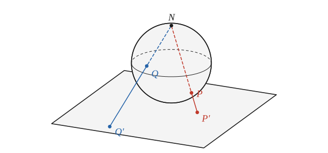
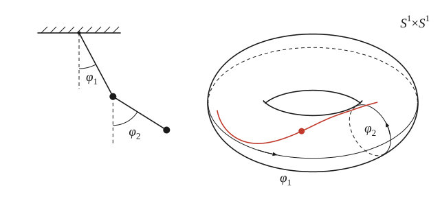
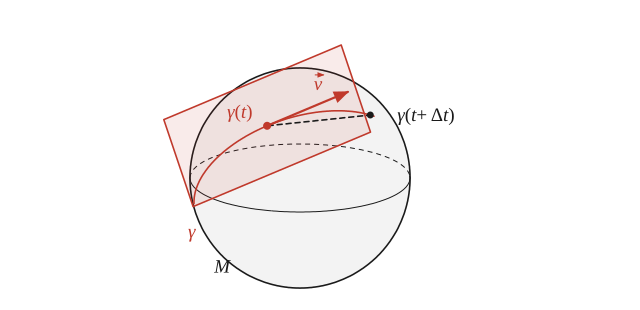
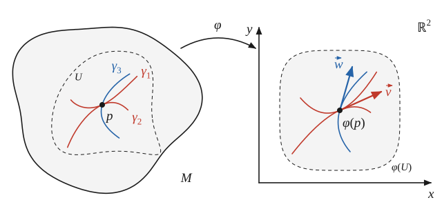
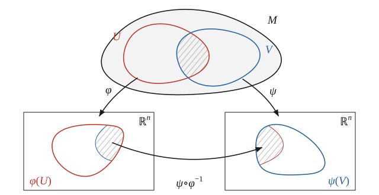
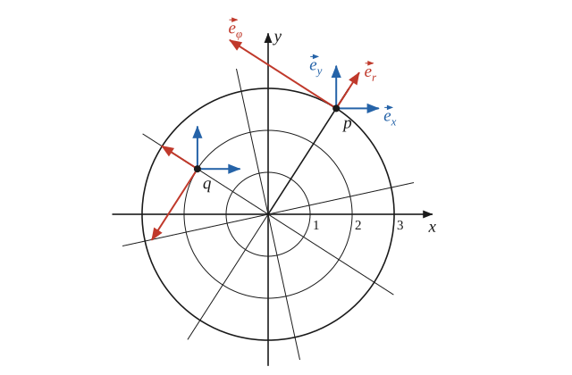

# Лекция 17. Касательное пространство

> **Черновик.** Расшифровки этой лекции пока нет; текст восстановлен по рукописным заметкам и содержит только то, что в них есть. Будет переписан, когда появится запись.

> **Необходимые знания:** функции нескольких переменных, частные производные, дифференцируемость, правило дифференцирования сложной функции; непрерывные отображения и гомеоморфизмы; отношение эквивалентности и классы эквивалентности; линейное пространство, базис, изоморфизм с пространством столбиков $S^n$ (лекции 2–3); первое знакомство с многообразиями и картами (лекция 16).
>
> **О чем лекция:** структуры, которые стоят за записью $\mathbb{R}^n$; гладкие многообразия, их примеры и конфигурационное пространство механической системы; касательный вектор как класс эквивалентности кривых; касательное пространство $T_pM$ и его линейная структура; производная скалярного поля вдоль вектора; базис касательного пространства, который задаёт карта.

Лекция начинается с вопроса о том, что на самом деле стоит за привычной записью $f\colon \mathbb{R}^3 \to \mathbb{R}$ и какими структурами $\mathbb{R}^3$ мы пользуемся, когда дифференцируем функцию. Затем вводятся многообразия — множества, которые устроены как $\mathbb{R}^n$ лишь по кускам, — и на них строится понятие скорости кривой, а вместе с ним и касательного вектора. Касательные векторы в точке $p$ многообразия образуют линейное пространство $T_pM$; вдоль них можно дифференцировать функции на многообразии, а карта задаёт в $T_pM$ базис.

## 1. Что стоит за записью $\mathbb{R}^3$

Рассмотрим функцию трёх переменных $f(x, y, z)$, т. е. отображение

$$
f\colon \mathbb{R}^3 \to \mathbb{R}.
$$

Что здесь такое $\mathbb{R}^3$? Как множество это декартово произведение $\mathbb{R}^3 = \mathbb{R} \times \mathbb{R} \times \mathbb{R}$, т. е. множество упорядоченных троек действительных чисел. Но, работая с функциями на $\mathbb{R}^3$, мы пользуемся не только этим. Вспомним, например, что значит дифференцируемость функции $f$: её приращение представляется в виде

$$
\Delta f = \frac{\partial f}{\partial x}\,\Delta x + \frac{\partial f}{\partial y}\,\Delta y + \frac{\partial f}{\partial z}\,\Delta z + o\bigl(|\Delta x| + |\Delta y| + |\Delta z|\bigr), \tag{1}
$$

причём остаток можно равносильно записать как $o\bigl(\sqrt{(\Delta x)^2 + (\Delta y)^2 + (\Delta z)^2}\bigr)$. Чтобы говорить о бесконечно малых приращениях, $\mathbb{R}^3$ нужно рассматривать как метрическое пространство. Формула переносится и на функции, зависящие ещё и от времени: для $f(x, y, z, t)$ в приращении появляется слагаемое $\frac{\partial f}{\partial t}\,\Delta t$.

Перечислим структуры, которые ассоциируются с $\mathbb{R}^n$:

- **топологическая** — с ней появляются предел и непрерывность, а дальше производные и т. д.;
- **метрическая** — расстояние между точками; метрика порождает топологию;
- **линейная** — сложение троек чисел и умножение их на число.

Кроме того, с обычным геометрическим пространством связаны ещё две структуры:

- **евклидова** — геометрическое пространство с длинами и углами; в декартовых координатах квадрат длины равен $x^2 + y^2 + z^2$;
- **аффинная** — например, обычное геометрическое пространство $\mathbb{R}^3$.

<!-- ПРОВЕРИТЬ (заметки, с. 1): список на доске разделён чертой — над ней топологическая (→ «произв. и т. д.»), метрическая (стрелка к топологической), линейная («сложение троек»); под ней евклидова («геометр. пр-во») и аффинная («например, обычное геометр. пр-во R³»), рядом оси и «x²+y²+z²». Как лектор комментировал нижнюю группу, по заметкам не восстановить; пояснения в двух последних пунктах — редакторские. -->

Посмотрим ещё, как выглядит главная часть приращения при замене координат. Пусть на плоскости, помимо координат $(x, y)$, введены другие координаты $(w, v)$, и одна и та же функция точки записывается в них как

$$
f(x, y) = f'(w, v),
$$

причём $f$ и $f'$ как функции двух переменных различны, поэтому и обозначены разными буквами (ср. лекцию 1). В каждой из систем координат главная часть приращения — произведение столбика частных производных на столбик приращений:

$$
\begin{pmatrix} \dfrac{\partial f}{\partial x} \\[8pt] \dfrac{\partial f}{\partial y} \end{pmatrix} \cdot \begin{pmatrix} \Delta x \\[8pt] \Delta y \end{pmatrix} = \Delta f, \qquad
\Delta f' = \begin{pmatrix} \dfrac{\partial f'}{\partial w} \\[8pt] \dfrac{\partial f'}{\partial v} \end{pmatrix} \cdot \begin{pmatrix} \Delta w \\[8pt] \Delta v \end{pmatrix}.
$$

В качестве примера рассматривалась замена

$$
w = x + y, \qquad v = x + 2y.
$$

*(Какой вывод делался из этого примера, по заметкам восстановить нельзя.)*

<!-- ПРОВЕРИТЬ (заметки, с. 1): рядом с примером набросок острого угла с подписью, похожей на «α = 50°» (или 60°), и оси с подписью y. Смысл наброска не ясен; координатные линии w = const и v = const пересекаются под углом ≈ 18,4°. -->

*Замечание редактора.* Проверим на этом примере, что обе записи дают одно и то же. Приращения новых координат: $\Delta w = \Delta x + \Delta y$, $\Delta v = \Delta x + 2\,\Delta y$. Дифференцируя $f(x, y) = f'(x + y,\, x + 2y)$ как сложную функцию, получаем

$$
\frac{\partial f}{\partial x} = \frac{\partial f'}{\partial w} + \frac{\partial f'}{\partial v}, \qquad \frac{\partial f}{\partial y} = \frac{\partial f'}{\partial w} + 2\,\frac{\partial f'}{\partial v},
$$

откуда

$$
\frac{\partial f}{\partial x}\,\Delta x + \frac{\partial f}{\partial y}\,\Delta y = \frac{\partial f'}{\partial w}\,(\Delta x + \Delta y) + \frac{\partial f'}{\partial v}\,(\Delta x + 2\,\Delta y) = \frac{\partial f'}{\partial w}\,\Delta w + \frac{\partial f'}{\partial v}\,\Delta v.
$$

Сами столбики при этом меняются по-разному: столбик приращений умножается на матрицу $A = \begin{pmatrix} 1 & 1 \\ 1 & 2 \end{pmatrix}$, а старый столбик производных выражается через новый с помощью $A^T$, т. е. новый получается из старого умножением на $(A^T)^{-1}$. Именно поэтому произведение столбиков не меняется — так же, как значение линейной формы на векторе не зависит от базиса (ср. лекции 3–5).

## 2. Многообразия

### 2.1. Определение и примеры

**Многообразием** называется множество, которое можно разбить на куски (вообще говоря, перекрывающиеся), каждый из которых гомеоморфен куску $\mathbb{R}^n$ со своей топологической (метрической) структурой. Гомеоморфизм

$$
\varphi\colon M \supset U \to \mathbb{R}^n
$$

куска $U$ многообразия $M$ на кусок $\mathbb{R}^n$ называется **картой**: он сопоставляет каждой точке куска $n$ чисел — её координаты. Многообразие называется **гладким**, если, кроме того, его карты «хорошие»; что это значит, уточним в п. 3.3.

Примеры.

*Сфера.* Карту на ней даёт, например, стереографическая проекция (рис. 1): сфера стоит на плоскости, и каждой её точке $P$, кроме северного полюса $N$, сопоставляется точка $P'$, в которой прямая $NP$ пересекает плоскость. Многообразиями являются также тор и поверхности более причудливой формы.

*Рис. 1. Стереографическая проекция — карта на сфере без северного полюса $N$: точке $P$ сферы сопоставляется точка $P'$, в которой прямая $NP$ пересекает плоскость. Чем ближе точка к $N$, тем дальше её образ (точка $Q$); самой точке $N$ ничего не соответствует.*

*Всё геометрическое пространство целиком* — тоже многообразие, и оно покрывается одной картой (декартовыми координатами $x, y, z$).

*Пространство-время* специальной и общей теории относительности — многообразия «в чистом виде». Пространство-время СТО покрывается одной картой; для ОТО это, вообще говоря, уже не так.

<!-- ПРОВЕРИТЬ (заметки, с. 2): «СТО, ОТО — многообразия в чистом виде»; под СТО — «покрывается одной картой», под ОТО — только знак вопроса. Восстановлено как «вообще говоря, уже не так». -->

*Конфигурационное пространство* механической системы — пример, о котором подробнее в следующем пункте.

### 2.2. Конфигурационное пространство

Положение простого маятника задаётся одним числом — углом отклонения $\varphi$ от вертикали. Положение двойного маятника (рис. 2) задаётся двумя углами

$$
\varphi_1 \in [0, 2\pi), \qquad \varphi_2 \in [0, 2\pi).
$$

Каждый из углов пробегает окружность, поэтому множество всех положений двойного маятника — его **конфигурационное пространство** — есть произведение двух окружностей $S^1 \times S^1$, т. е. тор. Движение маятника — кривая на этом торе.

*Рис. 2. Двойной маятник. Его положение задаётся углами $\varphi_1$ и $\varphi_2$; каждый из них пробегает окружность, и конфигурационное пространство — тор $S^1 \times S^1$. Положение маятника — точка на торе, его движение — кривая на торе.*

Конфигурационное пространство — всегда многообразие. Координаты на нём можно выбирать по-разному; их называют **обобщёнными координатами**, и от них требуется, чтобы они непрерывно параметризовали положения системы.

В $\mathbb{R}^3$ мы привыкли отождествлять точку с её радиус-вектором, т. е. со столбиком координат:

$$
\vec r \overset{?}{=} \begin{pmatrix} x \\ y \\ z \end{pmatrix}.
$$

Для конфигурационного пространства так поступить нельзя: **конфигурационное пространство — многообразие, но в общем случае без линейной структуры.** С этой точки зрения **механика — это движение точки по многообразию конфигурационного пространства.** Последовательно такой взгляд на механику проводится в книге В. И. Арнольда «Математические методы классической механики».

## 3. Касательный вектор

### 3.1. Скорость: в чём трудность

**Кривой** на многообразии $M$ называется отображение

$$
\gamma\colon [a, b] \to M, \qquad [a, b] \subset \mathbb{R};
$$

будем считать, что в картах координаты точки $\gamma(t)$ — дифференцируемые функции параметра $t$. Если точка движется по кривой, то в $\mathbb{R}^3$ её скорость мы определили бы как

$$
\lim_{\Delta t \to 0} \frac{\gamma(t + \Delta t) - \gamma(t)}{\Delta t}.
$$

На многообразии так сделать **никак** нельзя: в числителе стоит разность двух точек $M$, а вычитать точки многообразия невозможно — линейной структуры на нём нет. Наглядная картина касательной плоскости к поверхности (рис. 3) этой трудности не снимает: и хорда, и касательная плоскость лежат в объемлющем пространстве, а не на самом многообразии. Скорость придётся определить изнутри многообразия.

<!-- ПРОВЕРИТЬ (заметки, с. 3): заголовок фрагмента, с которого начинается построение, читается как «Внутренняя …ошка» (слово неразборчиво). Понято как «определение изнутри многообразия, без объемлющего пространства»; фраза про касательную плоскость — редакторская связка между рисунком M с красной плоскостью и надписью «НИКАК» у знака минус. -->

*Рис. 3. Кривая $\gamma$ на сфере $M$, лежащей в $\mathbb{R}^3$. Разность $\gamma(t + \Delta t) - \gamma(t)$ — хорда (пунктир), она проходит внутри шара, а не по сфере; в пределе получается вектор $\vec v$, лежащий в касательной плоскости. Обе конструкции пользуются объемлющим $\mathbb{R}^3$, а не самой сферой.*

### 3.2. Кривые с одинаковой скоростью

Нарисуем все возможные кривые $\gamma(t)$, проходящие через точку $p \in M$, — с учётом параметризации: кривые, проходящие по одному и тому же пути с разной скоростью, считаются разными. У некоторых из них скорость в точке $p$ может совпасть. Определим сначала, что значит *совпадение* скоростей.

Возьмём любую карту $\varphi\colon M \supset U \to \mathbb{R}^n$, область которой содержит $p$. В карте кривая превращается в $n$ обычных функций времени — координат точки $\gamma(t)$; например, при $n = 2$

$$
\gamma(t) \;\longmapsto\; \begin{pmatrix} x_\gamma(t) \\ y_\gamma(t) \end{pmatrix}.
$$

Эти функции можно дифференцировать, и столбик $\bigl(\dot x_\gamma(t), \dot y_\gamma(t)\bigr)$ — «скорость» кривой в этой карте (рис. 4). Кавычки здесь не случайны: столбик зависит от того, какая карта выбрана.

*Рис. 4. Кривые через точку $p$ на многообразии (слева) и их образы в карте $\varphi$ (справа). В карте у каждой кривой есть скорость — столбик $\bigl(\dot x(0), \dot y(0)\bigr)$, изображённый стрелкой. У $\gamma_1$ и $\gamma_2$ он общий ($\vec v$): эти кривые эквивалентны; у $\gamma_3$ он другой ($\vec w$).*

**Определение.** Две кривые $\gamma_1(t)$ и $\gamma_2(t)$, проходящие при $t = 0$ через одну точку, $\gamma_1(0) = \gamma_2(0) = p \in M$, **имеют одинаковую скорость** при $t = 0$, если в какой-то карте

$$
\dot x_{\gamma_1}(0) = \dot x_{\gamma_2}(0), \qquad \dot y_{\gamma_1}(0) = \dot y_{\gamma_2}(0).
$$

Такие кривые называются **эквивалентными**; пишут $\gamma_1 \sim \gamma_2$.

Если карта имеет $n$ координат, $\varphi = (\varphi_1, \dots, \varphi_n)$, то координаты точки кривой — это $\varphi_i\bigl(\gamma(t)\bigr)$ (при $n = 2$: $\varphi_1 = x$, $\varphi_2 = y$, так что $\frac{d}{dt}\varphi_1\bigl(\gamma_1(t)\bigr) = \dot x_{\gamma_1}$), и условие эквивалентности принимает вид

$$
\frac{d}{dt}\,\varphi_i\bigl(\gamma_1(t)\bigr)\Big|_{t=0} = \frac{d}{dt}\,\varphi_i\bigl(\gamma_2(t)\bigr)\Big|_{t=0}, \qquad i = 1, \dots, n. \tag{2}
$$

### 3.3. Независимость от карты

В определении сказано «в какой-то карте». Неоднозначности здесь нет благодаря следующему факту.

**Утверждение.** Если кривые эквивалентны в одной карте, то они эквивалентны и в любой другой.

Вспомним сначала, как связаны между собой две карты. Пусть $\varphi\colon U \to \mathbb{R}^n$ и $\psi\colon V \to \mathbb{R}^n$ — карты, области которых перекрываются (рис. 5). На образе перекрытия определена **функция перехода**

$$
f_{\text{пер}} = \psi \circ \varphi^{-1}\colon \mathbb{R}^n \to \mathbb{R}^n
$$

(точнее, она действует из $\varphi(U \cap V)$ в $\psi(U \cap V)$). Она заведомо непрерывна как композиция гомеоморфизмов. Многообразие называется **гладким**, если функция перехода бесконечно дифференцируема для любых двух карт:

$$
f_{\text{пер}} \in C^\infty.
$$

Это и есть «хорошие карты» из п. 2.1. Дальше все многообразия считаются гладкими.

*Рис. 5. Две карты: $\varphi$ на области $U$ и $\psi$ на области $V$. Перекрытие $U \cap V$ (штриховка) видно в обеих картах; функция перехода $\psi \circ \varphi^{-1}$ переводит $\varphi(U \cap V)$ в $\psi(U \cap V)$.*

*Доказательство.* Пусть кривые $\gamma_1, \gamma_2$ эквивалентны в карте $\varphi$, т. е. выполнено (2). Координаты точки в карте $\psi$ выражаются через её координаты в карте $\varphi$ с помощью компонент функции перехода:

$$
\psi_i = f_i(\varphi_1, \varphi_2, \dots, \varphi_n), \qquad i = 1, \dots, n.
$$

<!-- ПРОВЕРИТЬ (заметки, с. 4): на доске эта строка записана как φ₁ = f₁(ψ₁, ψ₂, …, ψₙ), т. е. в обратную сторону по сравнению с f_пер = ψ∘φ⁻¹ и с утверждением «эквивалентны в карте φ ⇒ в любой». Переписано согласованно с определением f_пер; для доказательства направление не важно. -->

По правилу дифференцирования сложной функции для любой кривой $\gamma$ через $p$

$$
\frac{d}{dt}\,\psi_i\bigl(\gamma(t)\bigr) = \frac{d}{dt}\,f_i\Bigl(\varphi_1\bigl(\gamma(t)\bigr), \dots, \varphi_n\bigl(\gamma(t)\bigr)\Bigr) = \sum_{j=1}^{n} \frac{\partial f_i}{\partial \varphi_j}\,\frac{d}{dt}\,\varphi_j\bigl(\gamma(t)\bigr).
$$

При $t = 0$ частные производные $\partial f_i / \partial \varphi_j$ для обеих кривых берутся в одной и той же точке $\varphi(p)$, а производные $\frac{d}{dt}\varphi_j\bigl(\gamma(t)\bigr)$ у кривых совпадают по условию. Значит, совпадают и левые части: кривые эквивалентны в карте $\psi$.

Проследим то же самое подробно для $n = 2$. Пусть в карте $\varphi$ координаты — $(x, y)$, в карте $\psi$ — $(v, w)$, и переход между картами задан функциями

$$
\boxed{\; v = V(x, y), \qquad w = W(x, y) \;}
$$

Кривые в карте $\varphi$ — это $\bigl(x_1(t), y_1(t)\bigr)$ и $\bigl(x_2(t), y_2(t)\bigr)$, и по условию $\dot x_1(0) = \dot x_2(0)$, $\dot y_1(0) = \dot y_2(0)$. В карте $\psi$

$$
v_1(t) = V\bigl(x_1(t), y_1(t)\bigr), \qquad v_2(t) = V\bigl(x_2(t), y_2(t)\bigr),
$$

и

$$
\begin{aligned}
\dot v_1(0) &= \frac{\partial V}{\partial x}\,\dot x_1(0) + \frac{\partial V}{\partial y}\,\dot y_1(0), \\
\dot v_2(0) &= \frac{\partial V}{\partial x}\,\dot x_2(0) + \frac{\partial V}{\partial y}\,\dot y_2(0).
\end{aligned}
$$

Частные производные в обеих строках берутся в точке $\bigl(x_1(0), y_1(0)\bigr) = \bigl(x_2(0), y_2(0)\bigr)$ — это координаты точки $p$, — а остальные множители равны по условию. Поэтому $\dot v_1(0) = \dot v_2(0)$; точно так же $\dot w_1(0) = \dot w_2(0)$, что и завершает доказательство.

**Вывод:** эквивалентность кривых по совпадению скоростей определена корректно, т. е. не зависит от карты: если скорости совпадают в одной карте, то совпадают и в любой. Заметим ещё, что $\sim$ — действительно отношение эквивалентности (рефлексивно, симметрично и транзитивно): в фиксированной карте оно сводится к равенству столбиков.

### 3.4. Вектор как класс эквивалентности кривых

Всё множество кривых, проходящих через точку $p$ ($\gamma(0) = p \in M$), распадается на подмножества эквивалентных кривых — классы эквивалентности. Кривые одного класса роднит «скорость»: это характеристика всего класса. Это и есть «вектор»:

**Касательный вектор** в точке $p$ многообразия $M$ — это класс эквивалентности кривых, проходящих через $p$.

Запись $\gamma \in \vec v$ означает, что кривая $\gamma$ принадлежит классу $\vec v$. В любой карте всем кривым класса отвечает один и тот же столбик $\bigl(\dot x(0), \dot y(0)\bigr)$.

<!-- ПРОВЕРИТЬ (заметки, с. 5): после «это и есть „вектор“ —» стоит подчёркнутое неразборчивое слово («ко…вен»?); в текст не вошло. -->

## 4. Касательное пространство $T_pM$

Предъявим на множестве классов эквивалентности кривых линейную структуру и докажем, что она определена корректно.

«Сядем» в карту. Каждой кривой $\gamma$ через $p$ карта сопоставляет столбик

$$
\begin{pmatrix} \dot x(0) \\ \dot y(0) \end{pmatrix} \in S^2,
$$

где $S^2$ — пространство столбиков высоты $2$ (лекция 2; не путать с окружностью $S^1$ из п. 2.2). Эквивалентным кривым отвечает один и тот же столбик, неэквивалентным — разные. Кроме того, встречается любой столбик $(a, b)^T$: ему отвечает, например, кривая, которая в карте идёт по прямой $\bigl(x_p + a t,\; y_p + b t\bigr)$, где $(x_p, y_p)$ — координаты точки $p$. Таким образом, в карте множество классов взаимно однозначно соответствует $S^2$.

В $S^2$ есть линейные операции: сумма столбиков и произведение столбика на число дают новый столбик, а за ним точно прячется новый класс — такой класс эквивалентности существует. Это и даёт определение: **суммой** векторов $\vec v_1$ и $\vec v_2$ называется класс, которому в карте отвечает сумма их столбиков, а **произведением** $\alpha \vec v$ — класс, которому отвечает столбик вектора $\vec v$, умноженный на $\alpha$. Это определение корректно, поскольку от карты не зависит.

**Касательным пространством** к многообразию $M$ в точке $p \in M$ называется множество касательных векторов в этой точке с введённой линейной структурой. Обозначение:

$$
T_pM.
$$

Соответствие между $T_pM$ и пространством столбиков, которое задаёт карта, — изоморфизм линейных пространств; в частности, размерность $T_pM$ равна размерности многообразия.

*Замечание редактора.* Почему определение не зависит от карты, видно из вычисления п. 3.3: столбик скорости в карте $\psi$ получается из столбика в карте $\varphi$ умножением на матрицу частных производных функции перехода в точке $\varphi(p)$,

$$
\begin{pmatrix} \dot v(0) \\[4pt] \dot w(0) \end{pmatrix} = \begin{pmatrix} \dfrac{\partial V}{\partial x} & \dfrac{\partial V}{\partial y} \\[8pt] \dfrac{\partial W}{\partial x} & \dfrac{\partial W}{\partial y} \end{pmatrix} \begin{pmatrix} \dot x(0) \\[4pt] \dot y(0) \end{pmatrix}.
$$

Матрица одна и та же для всех кривых через $p$, а умножение на матрицу переводит сумму столбиков в сумму, а кратное — в кратное. Поэтому класс, построенный по сумме столбиков в карте $\varphi$, совпадает с классом, построенным по сумме столбиков в карте $\psi$. Эта же формула отвечает на вопрос, которым заканчивается лекция (п. 6).

## 5. Скалярное поле и его дифференцирование

Отображение

$$
f\colon M \to \mathbb{R}
$$

называется **полем** (скалярным полем) на многообразии $M$. Пример — температура в комнате: каждой точке комнаты сопоставлено число $T$; другой пример — давление.

Что значит производная поля вдоль вектора $\vec v \in T_pM$? Возьмём любую кривую $\gamma \in \vec v$. Функция $f\bigl(\gamma(t)\bigr)$ — обычная числовая функция переменной $t$, и её можно продифференцировать. По определению

$$
\boxed{\; \frac{d}{dt}\, f\bigl(\gamma(t)\bigr)\Big|_{t=0} \equiv \partial_{\vec v} f \;}
$$

— **производная поля $f$ вдоль вектора $\vec v$**.

*Замечание редактора.* Результат не зависит от того, какая кривая из класса $\vec v$ взята. В карте поле записывается функцией координат $F = f \circ \varphi^{-1}$, так что $f\bigl(\gamma(t)\bigr) = F\bigl(x(t), y(t)\bigr)$ и

$$
\frac{d}{dt}\, f\bigl(\gamma(t)\bigr)\Big|_{t=0} = \frac{\partial F}{\partial x}\,\dot x(0) + \frac{\partial F}{\partial y}\,\dot y(0),
$$

а это выражение зависит только от столбика скорости, общего для всех кривых класса.

## 6. Базис касательного пространства

Пусть $M$ — многообразие, $p \in M$ — точка, $T_pM$ — касательное пространство. Это линейное пространство, и в нём можно выбирать базисы. **До введения карты все базисы равноправны**; выбор карты выделяет среди них один, предпочтительный.

Выберем карту с координатами $(x, y)$. Через точку $p$ проходят две её **координатные линии** — кривые, вдоль которых меняется только одна координата; в карте они записываются как

$$
\bigl(x_p + t,\; y_p\bigr) \qquad \text{и} \qquad \bigl(x_p,\; y_p + t\bigr).
$$

Им отвечают столбики $(1, 0)^T$ и $(0, 1)^T$ — базис пространства столбиков. Поэтому классы этих кривых — обозначим их $\vec e_x$ и $\vec e_y$ — образуют базис $T_pM$, а компоненты вектора $\vec v$ в этом базисе — это в точности его столбик $\bigl(\dot x(0), \dot y(0)\bigr)$ в данной карте. **Базис диктуется картой.**

<!-- ПРОВЕРИТЬ (заметки, с. 6): у рисунка с полярными координатами красным подписано «γ(t) = (0, t) в карте»; понято как координатная линия (меняется только одна координата) и записано в общем виде. Обозначения e_x, e_y взяты из заметок лекции 18 («коорд. кр. x ⟺ e_x ⟺ ∂/∂x»); в заметках лекции 17 базисные векторы не названы. -->

*Пример: полярные координаты на плоскости* (здесь $\varphi$ — полярный угол, а не карта). Координатные линии полярной карты — окружности $r = \text{const}$ и лучи $\varphi = \text{const}$. Возьмём точку $p$ с координатами

$$
r_p = 3, \qquad \varphi_p = 1.
$$

Базис в $p$ образуют скорости двух координатных линий через $p$: луча $\varphi = 1$ (вектор $\vec e_r$) и окружности $r = 3$ (вектор $\vec e_\varphi$), см. рис. 6. В другой точке $q$ координатные линии другие, и базис другой. Для сравнения: у декартовой карты координатные линии — прямые, параллельные осям, и её базис $\vec e_x, \vec e_y$ во всех точках один и тот же.

<!-- ПРОВЕРИТЬ (заметки, с. 6): синим нарисованы оси x, y, дуга-стрелка у оси y и несколько одинаковых маленьких «уголков» в разных местах, рядом подпись «координатные линии». Понято как декартов базис, одинаковый во всех точках; последняя фраза абзаца — это толкование. -->

*Рис. 6. Полярные координаты (вне начала координат): координатные линии — окружности $r = 1, 2, 3$ и лучи $\varphi = \text{const}$; линии через точку $p$ ($r_p = 3$, $\varphi_p = 1$) выделены. Красные стрелки — базис $\vec e_r, \vec e_\varphi$, который полярная карта задаёт в точках $p$ и $q$; синие — базис декартовой карты, одинаковый во всех точках. Масштаб истинный.*

*Замечание редактора.* В декартовых координатах координатные линии полярной карты через точку $p$ — это

$$
t \mapsto \bigl((r_p + t)\cos\varphi_p,\ (r_p + t)\sin\varphi_p\bigr), \qquad t \mapsto \bigl(r_p\cos(\varphi_p + t),\ r_p\sin(\varphi_p + t)\bigr).
$$

Дифференцируя при $t = 0$, получаем столбики векторов $\vec e_r$ и $\vec e_\varphi$ в декартовой карте:

$$
\vec e_r:\ \begin{pmatrix} \cos\varphi_p \\ \sin\varphi_p \end{pmatrix} \approx \begin{pmatrix} 0{,}54 \\ 0{,}84 \end{pmatrix}, \qquad
\vec e_\varphi:\ \begin{pmatrix} -r_p\sin\varphi_p \\ r_p\cos\varphi_p \end{pmatrix} \approx \begin{pmatrix} -2{,}52 \\ 1{,}62 \end{pmatrix}.
$$

Векторы полярного базиса меняются от точки к точке не только по направлению, но и по длине: длина $\vec e_\varphi$ равна $r$.

Остаётся вопрос, на котором лекция заканчивается: **как меняются компоненты одного и того же вектора при замене карты?**

---

*Конец лекции 17.*
